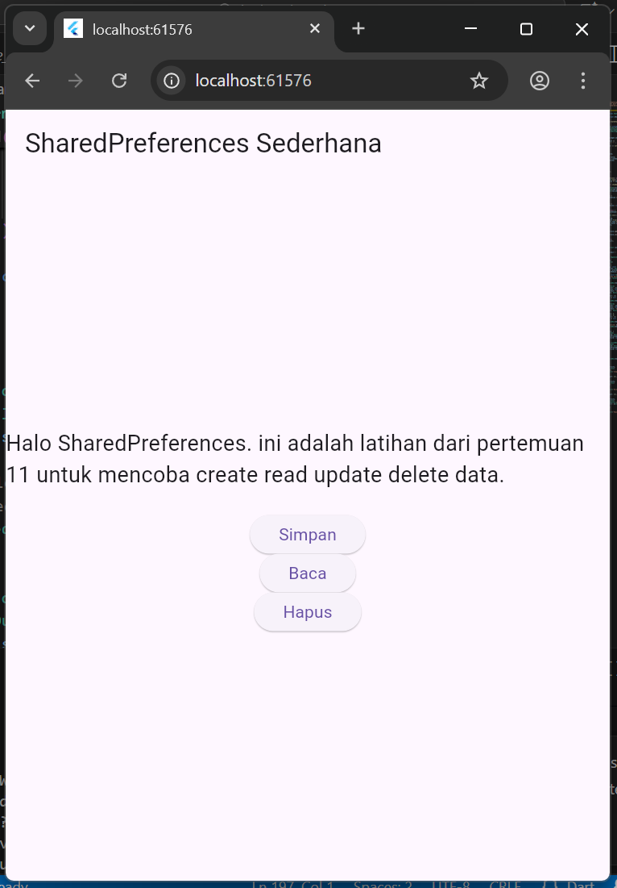
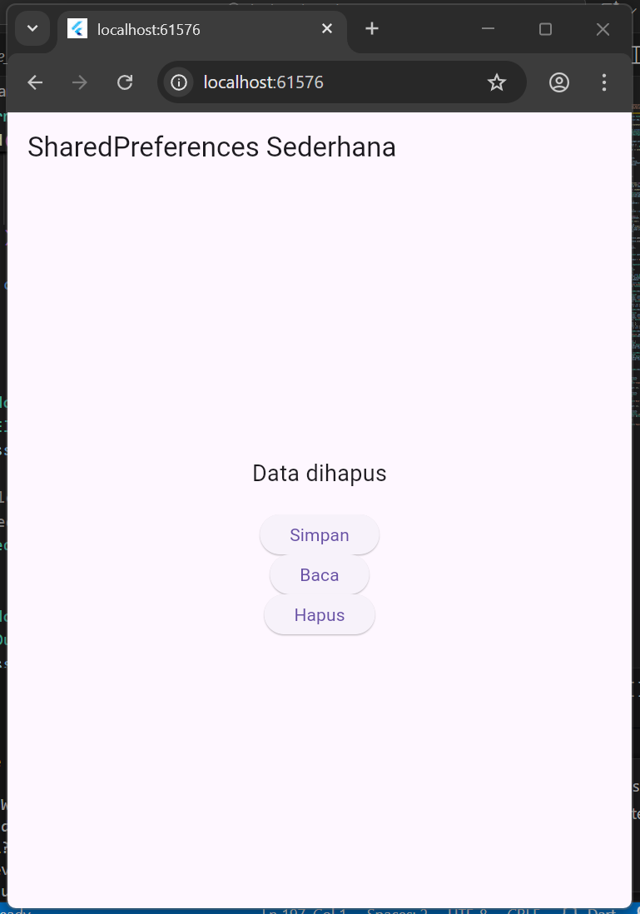
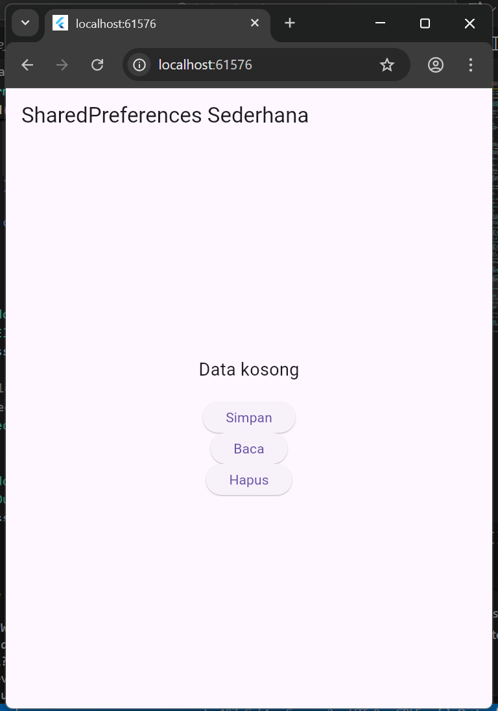

# ELearningPM2

Aplikasi Flutter untuk mata kuliah **Pemrograman Mobile 2**.  
Project ini merupakan latihan penggunaan **Flutter + SQLite**.

---

## Fitur Aplikasi
- CRUD Notes (Tambah, Baca, Edit, Hapus)
- Penyimpanan lokal (SQLite)

---

## Screenshot Aplikasi

## Video Demo Aplikasi
 [Demo App - Google Drive](https://drive.google.com/drive/folders/1d4KTzf-t_KoLZvjZ0CDU3B-X06-k3LwC?usp=drive_link)**

- Mata Kuliah: Pemrograman Mobile 2
- Project: Latihan Shared Preferences
